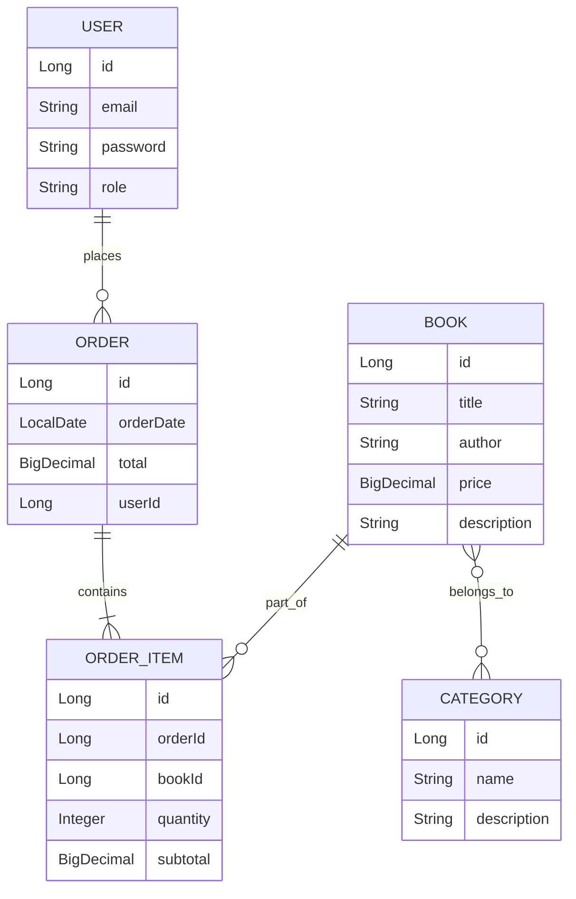

<h1 id="top">📚 Book Store Application</h1>


---

## 📑 Table of Contents
- [Overview](#-overview)
- [Technologies Used](#-technologies-used)
- [Environment Configuration](#-environment-configuration)
- [Running the Application](#-running-the-application)
- [API Documentation](#-api-documentation)
- [Testing](#-testing)
- [Postman Collection](#-postman-collection)
- [Model Diagram](#-model-diagram)
- [Challenges & Learnings](#-challenges--learnings)
- [Author](#-author)

---

## 🏷️ Overview

Book Store is a full-featured Spring Boot application that allows users to:
- Manage and browse books
- Handle categories
- Perform user authentication and authorization using JWT

It follows a layered architecture and demonstrates clean REST API design with Spring Security, JPA, and Liquibase integration.

---

## 🛠️ Technologies Used

✨ Java 17+  
✨ Spring Boot  
✨ Spring Data JPA  
✨ Hibernate  
✨ Spring Security (JWT Authentication)  
✨ Liquibase (Database Migration Management)  
✨ MapStruct (DTO Mapping)  
✨ Lombok  
✨ MySQL  
✨ Docker  
✨ Mockito  
✨ Swagger  
✨ Maven

---

## ⚙️ Environment Configuration

This project uses environment variables to manage sensitive data and configuration.  
You can define them manually or use the provided `.env` file.

### 🧩 Example `.env` file

#### Database Configuration
```
MYSQLDB_USER=root
MYSQLDB_ROOT_PASSWORD=password
MYSQLDB_DATABASE=bookstore
MYSQLDB_LOCAL_PORT=3307
MYSQLDB_DOCKER_PORT=3306
```
## Spring Application Ports
```
SPRING_LOCAL_PORT=8088
SPRING_DOCKER_PORT=8080
DEBUG_PORT=5005
```
## JWT Configuration
```
JWT_SECRET=supersecretkeysupersecretkeysupersecretkey
JWT_EXPIRATION=3600000
```
---
## 🚀 Running the Application
### 1️⃣ Clone the Repository
```
git clone https://github.com/KLICKICE/spring-boot-book-store-jpa-exceptions.git
cd book-store
```
### 2️⃣ Build the Project
```
mvn clean install
```
### 3️⃣ Run with Docker (recommended)
```
docker-compose up --build
```

This will start:
MySQL Database
```
Spring Boot backend on port 8080
```
### 4️⃣ Run Locally
```
mvn spring-boot:run
```

The app will be available at:
👉 [link](http://localhost:8080/api)
---
### 📘 API Documentation

Swagger UI is available at:
👉 [link](http://localhost:8080/api/swagger-ui/index.html)

### You can test:
```
User authentication
CRUD operations for books and categories
User management
```
## 🧪 Testing

Run all unit and integration tests:
```
mvn test
```
## 🧰 Postman Collection

A Postman collection is included at:
`/postman/BookStoreAPI.postman_collection.json`

You can import it into Postman to quickly test all endpoints.

## 🧩 Model Diagram

The diagram below illustrates the relationships between main entities:


---
## 💡 Challenges & Learnings

During development, I learned how to:

- Integrate JWT authentication with Spring Security
- Configure Liquibase for automated database migrations
- Use Docker for local development
- Map entities and DTOs efficiently with MapStruct
- Implement clean REST architecture and global exception handling

## 👤 Author

Developed by:
Oleksandr
📧 Email: [link](mailto:ledmaskiight@gmail.com)
💼 GitHub: [link](https://github.com/KLICKICE)

<p align="right">(<a href="#top">⬆️ Back to top</a>)</p>